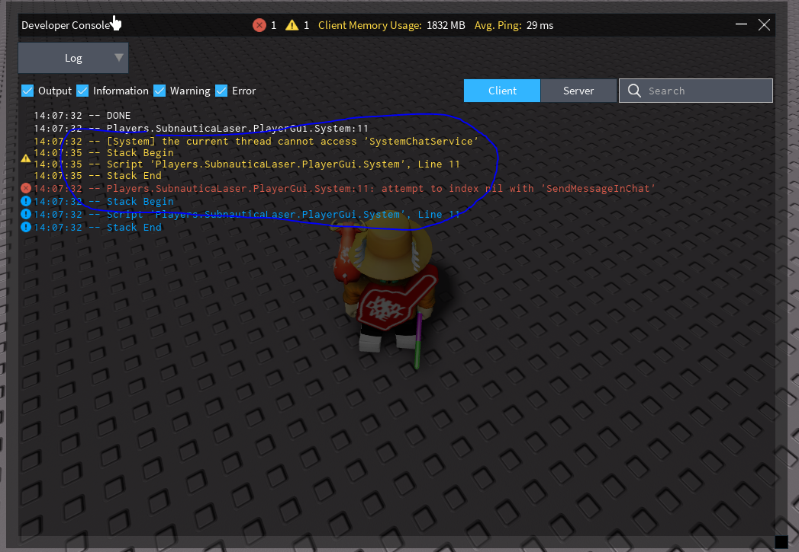
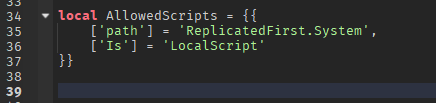

This ModuleScript has functions u can call, and help u make a game better, i will try to main-tain this Module to always work for the Latest Version of roblox, medout changing any names, so u can always use it

NOTE: SOME FUNCTIONS WORKS FOR BOTH Client AND Server SIDE SCRIPTS

## Functions:

SystemPlayerService

SystemChatService

SystemReplicatedStorage

## SystemPlayerService:

**getBackpack** - Returns the Backpack from the Player. Client AND Server

**getStarterGear** - Returns the StarterGear from the Player. Client AND Server

**getPlayerScripts** - Returns PlayerScripts from the Player. Client AND Server

## SystemChatService:

**SendMessageInChat** - Contains functions to send Message's in Chat. NOT FROM PLAYER. Client AND Server

**IsChatOnLatestVersion** - Returns FALSE if Chat is on LEGACYCHATSERVICE. Client AND Server

### SendMessageInChat:

**SendMessage** - Sends a Message in Chat. Client AND Server

**SendMessageWithFont** - You can send a Message in chat with. Color, Font and MORE. Client AND Server | Args: *Text: string, Color: Color3, FontEnum: Enum.Font, FontSize: number | string*

### How to Allow Scripts?

You mith have noticed this when u tried to call a function inside the **SystemModule**

   

## How to Fix
Go to this line in the Code

   

